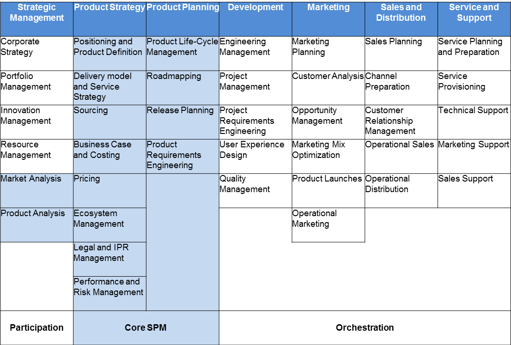

```{r setup, include=FALSE}
knitr::opts_chunk$set(echo = TRUE)
```

# Research Methodology {.tabset}

```{r summary, echo = FALSE, message=FALSE, tidy=TRUE, results='asis'}
summary(report::report(sessionInfo()))
```

```{r child='../code book.md'}
```

# Descriptive Statistics


## Demographics - Organisational Context

What is the make up of the organisations that the respondents are working in?

```{r org, echo=FALSE}
library(knitr)
library(dplyr)

summary(clean_responses[3:4]) %>% kable
summary(clean_responses[5:7]) %>% kable
```


## Demographics - Respondents {.tabset}

And where are they located?

### Map


### Location data

```{r location_data}
clean_responses %>%
  group_by(org.location) %>%
  summarise(n = n()) %>%
  kable()

```

## Role - Perceptions 

How happy were the respondents with their roadmap process and level of responsibility in the role?
```{r role, echo=FALSE}
clean_responses %>%
  select(Job.title, roadmap.happiness, role.happiness , roadmap.DEEPScore, roadmap.mat_level) %>% 
  group_by(Job.title) %>%
  summarise(n = n(),
            roadmap.happiness = mean(roadmap.happiness),
            role.happiness = mean(role.happiness))  %>% 
  kable(digits = 2)


 

```


## Role - Responsibilities ISPMA model  {.tabset}

Next we asked which activities we part of the respondent's responsibilities based on the ISPMA's v1.3 of the Framework



All tables below as percentages of respondents who answered yes to the specified activities.

### Strategic management

```{r}

practices %>%
  select(Job.title, sm.corpstrat, sm.portfoliomgmt, sm.innovationmgmt, sm.resmgmt, sm.marketanalysis, sm.prodanalysis) %>%
  group_by(Job.title) %>%
  summarise("Corporate Strategy" = round(sum(sm.corpstrat)/n()*100),
            "Portfolio Management" = sum(sm.portfoliomgmt)/n()*100,
            "Innovation Management" = sum(sm.innovationmgmt)/n()*100,
            "Resource Management" = sum(sm.resmgmt)/n()*100,
            "Market Analysis" = sum(sm.marketanalysis)/n()*100,
            "Product Analysis" = sum(sm.prodanalysis)/n()*100) %>%
  kable()


```

### Product Strategy

```{r}
practices %>%
  select(roadmap.mat_level, ps.position, ps.deliverymodel, ps.sourcing, ps.bizcase, ps.pricing, ps.ecosystem, ps.legalandpr, ps.perfandrisk) %>%
  group_by(roadmap.mat_level) %>%
  summarise("Positioning and product definition" = sum(ps.position)/n()*100,
            "Delivery model & Service strategy" = sum(ps.deliverymodel)/n()*100,
            "Sourcing" = sum(ps.sourcing)/n()*100,
            "Business case and costing" = sum(ps.bizcase)/n()*100,
            "Pricing" = sum(ps.pricing)/n()*100,
            "Ecosystem management" = sum(ps.ecosystem)/n()*100,
            "Legal & PR management" = sum(ps.legalandpr)/n()*100,
            "Performance & Risk management" = sum(ps.perfandrisk)/n()*100) %>%
  kable()


```

### Product Planning

```{r}
practices %>%
  select(roadmap.mat_level, pp.lifecycle, pp.roadmapping, pp.releaseplanning, pp.prodRE) %>%
  group_by(roadmap.mat_level) %>%
  summarise("Product life-cycle management" = sum(pp.lifecycle)/n()*100,
            "Roadmapping" = sum(pp.roadmapping)/n()*100,
            "Release planning" = sum(pp.releaseplanning)/n()*100,
            "Product requirements engineering" = sum(pp.prodRE)/n()*100) %>%
  kable()


```

### Development

```{r}

practices %>%
            select(roadmap.mat_level, dev.engmgmt,dev.projmgmt, dev.projRE, dev.ux, dev.qual ) %>%
            group_by(roadmap.mat_level) %>%
            summarise("Engineering Management" = sum(dev.engmgmt)/n()*100,
                      "Project Management" = sum(dev.projmgmt)/n()*100,
                      "Project requirements engineering" = sum(dev.projRE)/n()*100,
                      "User experience design" = sum(dev.ux)/n()*100,
                      "Quality Management" = sum(dev.qual)/n()*100) %>%
  kable()
        

```

### Marketing

```{r mar}

          practices %>%
            select(roadmap.mat_level, mar.plan,mar.cust, mar.oppomgmt, mar.mix, mar.gtm,mar.ops ) %>%
            group_by(roadmap.mat_level) %>%
            summarise("Marketing planning" = sum(mar.plan)/n()*100,
                      "Customer analysis" = sum(mar.cust)/n()*100,
                      "Opportunity Management" = sum(mar.oppomgmt)/n()*100,
                      "Marketing mix optimisation" = sum(mar.mix)/n()*100,
                      "Product launches (GTM)" = sum(mar.gtm)/n()*100,
                      "Operational marketing" = sum(mar.ops)/n()*100) %>%
  kable()

```

### Sales and Distribution

```{r}
```

### Service and Support

```{r}
```


## Information Sources

Where do people go to get their information?

```{r role2, echo=FALSE}
clean_responses %>%
  select(Job.title, info.events, info.blogs, info.books, info.communities, info.profbody, info.profcert, info.training, info.vendor, info.google) %>%
  group_by(Job.title) %>%
  summarise("Events and conferences" = sum(info.events)/n()*100,
            "Blogs" = sum(info.blogs)/n()*100,
            "Books" = sum(info.books)/n()*100,
            "Online Communities" = sum(info.communities)/n()*100,
            "Professional Bodies" = sum(info.profbody)/n()*100,
            "Professional Certification" = sum(info.profcert)/n()*100,
            "Professional Training" = sum(info.training)/n()*100,
            "Tool Vendor material" = sum(info.vendor)/n()*100,
            "Google" = sum(info.google)/n()*100)  %>% 
  kable(digits = 2)
```

Which professional bodies are they members of?

```{r profbdy, echo=FALSE}
clean_responses %>%
  select(Job.title, profbody.acm, profbody.aipmm, profbody.apm, profbody.bcs, profbody.iaoip, profbody.ispma, profbody.pdma, profbody.MTP, profbody.WiP, profbody.none) %>%
  group_by(Job.title) %>%
  summarise("ACM" = round(sum(profbody.acm)/n()*100),
            "AIPMM" = sum(profbody.aipmm)/n()*100,
            "BCS" = sum(profbody.bcs)/n()*100,
            "ISPMA" = sum(profbody.ispma)/n()*100,
            "PDMA" = sum(profbody.pdma)/n()*100,
            "MTP" = sum(profbody.MTP)/n()*100,
            "WiP" = sum(profbody.WiP)/n()*100,
            "None" = sum(profbody.none)/n()*100) %>%
  kable(digits = 2)
```

## DEEP Roadmap Maturity {.tabset}

There were a spread of responses, but generally skewing to the right. In the charts below the least "mature" practices are to the left and the highest scoring, mature processes to the right. (According to [DEEP Product Maturity Model](https://www.researchgate.net/publication/336070112_The_Product_Roadmap_Maturity_Model_DEEP_Validation_of_a_Method_for_Assessing_the_Product_Roadmap_Capabilities_of_Organizations) V1.1 By Munch, Trieflinger and Lang.)

### All responses

```{r deep_roadmap_all, echo=FALSE}
items <- clean_responses[,18:26]
colly <- names(items)


par(mfrow=c(3,3))

for(i in 1:ncol(items)) {
  plot(items[,i], main = colly[i], axes=FALSE)
  Axis(side=1, labels=FALSE)
  Axis(side=2, labels=TRUE)
}

mtext(paste("DEEP responses, n=" , nrow(items)), side=1, outer=TRUE, line=-3)
```

### Product responses

```{r deep_roadmap_prod, echo=FALSE}
items <- prod_responses[,18:26]
colly <- names(items)


par(mfrow=c(3,3))

for(i in 1:ncol(items)) {
  plot(items[,i], main = colly[i], axes=FALSE)
  Axis(side=1, labels=FALSE)
  Axis(side=2, labels=TRUE)
}

mtext(paste("DEEP responses, n=" , nrow(items)), side=1, outer=TRUE, line=-3)
```

### by job title

How mature were the roadmap processes by job title of respondent? 

```{r roadmap_des, echo=FALSE, results='asis'}
  
clean_responses %>%
  select(Job.title, roadmap.DEEPScore, roadmap.mat_level) %>% 
  group_by(Job.title) %>%
  summarise(n = n(),
            roadmap.DEEPScore = mean(roadmap.DEEPScore),
            roadmap.mat_level = mean(roadmap.mat_level))  %>% 
  kable(digits = 2)


```

## Tool usage {.tabset}

What kind of tools did the respondents use? 

### All

Percentage of tools types used

```{r tools_all, results='asis'}
  
    tools %>%
            select(custom , office , product , project ) %>%
            summarise("Custom Tools" = sum(custom)/n()*100,
                      "Office Tools" = sum(office)/n()*100,
                      "Specialist Product Tools" = sum(product)/n()*100,
                      "Project management tools" = sum(project)/n()*100)  %>% 
  kable(digits = 2, title = "Percentage of tools types used")

cat("count of tools broken out by category")

 toolsBreakdown <- data.frame(category = "Custom",
                             tool = "custom",
                             count = sum(tools[,"custom"]))
toolsBreakdown <- rbind(toolsBreakdown,data.frame(category = "Project",
                             tool = "ATLASSIAN: Jira/Confluence",
                             count = length(grep("Jira", tools[,7], ignore.case = TRUE))))
toolsBreakdown <- rbind(toolsBreakdown,data.frame(category = "Office",
                                                  tool = "Google Sheets",
                                                  count = length(grep("sheets", tools[,7], ignore.case = TRUE))))
toolsBreakdown <- rbind(toolsBreakdown,data.frame(category = "Office",
                                                  tool = "Microsoft Excel",
                                                  count = length(grep("Excel", tools[,7], ignore.case = TRUE))))
toolsBreakdown <- rbind(toolsBreakdown,data.frame(category = "Office",
                                                  tool = "Google Slides",
                                                  count = length(grep("Google Slides", tools[,7], ignore.case = TRUE))))
toolsBreakdown <- rbind(toolsBreakdown,data.frame(category = "Office",
                                                  tool = "MICROSOFT: PowerPoint",
                                                  count = length(grep("PowerPoint", tools[,7], ignore.case = TRUE))))

toolsBreakdown <- rbind(toolsBreakdown,data.frame(category = "Project",
                                                  tool = "MICROSOFT: Project Server",
                                                  count = length(grep("MICROSOFT: Project Server", tools[,7], ignore.case = TRUE))))
toolsBreakdown <- rbind(toolsBreakdown,data.frame(category = "Project",
                                                  tool = "taskstreamer",
                                                  count = length(grep("taskstreamer", tools[,7], ignore.case = TRUE))))
toolsBreakdown <- rbind(toolsBreakdown,data.frame(category = "Project",
                                                  tool = "ServiceNow",
                                                  count = length(grep("ServiceNowr", tools[,7], ignore.case = TRUE))))
toolsBreakdown <- rbind(toolsBreakdown,data.frame(category = "Project",
                                                  tool = "Planview",
                                                  count = length(grep("Planview", tools[,7], ignore.case = TRUE))))
toolsBreakdown <- rbind(toolsBreakdown,data.frame(category = "Project",
                                                  tool = "Trello",
                                                  count = length(grep("Trello", tools[,7], ignore.case = TRUE))))
toolsBreakdown <- rbind(toolsBreakdown,data.frame(category = "Product",
                                                  tool = "ITONICS: Roadmapping-Engine",
                                                  count = length(grep("roadmap", tools[,7], ignore.case = TRUE))))
toolsBreakdown <- rbind(toolsBreakdown,data.frame(category = "Product",
                                                  tool = "AHA!",
                                                  count = length(grep("AHA", tools[,7], ignore.case = TRUE))))
toolsBreakdown <- rbind(toolsBreakdown,data.frame(category = "Product",
                                                  tool = "Roadmunk",
                                                  count = length(grep("Roadmunk", tools[,7], ignore.case = TRUE))))
toolsBreakdown <- rbind(toolsBreakdown,data.frame(category = "Product",
                                                  tool = "ProductPlan",
                                                  count = length(grep("ProductPlan", tools[,7], ignore.case = TRUE))))
toolsBreakdown <- rbind(toolsBreakdown,data.frame(category = "Product",
                                                  tool = "Productboard",
                                                  count = length(grep("Productboard", tools[,7], ignore.case = TRUE))))
toolsBreakdown <- rbind(toolsBreakdown,data.frame(category = "Product",
                                                  tool = "Pendo",
                                                  count = length(grep("Pendo", tools[,7], ignore.case = TRUE))))
toolsBreakdown <- rbind(toolsBreakdown,data.frame(category = "Product",
                                                  tool = "ProdPad",
                                                  count = length(grep("ProdPad", tools[,7], ignore.case = TRUE))))

toolsBreakdown %>%
  group_by(category, tool, count) %>%
  arrange(category, tool, desc(count)) %>%
      kable

```

### Product

Percentage of tools types used

```{r tools_pm, echo=FALSE, results='asis'}

 pm.tools <-      tools %>%
             filter(grepl('Product', Job.title)) 
  
    pm.tools %>%
            select(custom , office , product , project ) %>%
            summarise("Custom Tools" = sum(custom)/n()*100,
                      "Office Tools" = sum(office)/n()*100,
                      "Specialist Product Tools" = sum(product)/n()*100,
                      "Project management tools" = sum(project)/n()*100) %>% 
  kable(digits = 2, title = "Percentage of tools types used")
    
    cat("populatity of tool combinations")

    pm.tools %>%
  select(roadmap.tools ) %>%
  group_by(roadmap.tools)%>%
  tally(sort = T) %>%
  ungroup() %>%
  arrange(desc(n)) %>%
      kable

```

# Inferential Statistics 

did happiness with the roadmap process correlate to a higher maturity score?


```{r roadmap_inf, echo=FALSE, results='asis'}
library(qqplotr)
library(gridExtra)

#create model to check correlation
 lmHappyRoadmap = lm(roadmap.happiness ~ roadmap.DEEPScore , data = prod_responses)


ggplot(prod_responses) +
  geom_point(aes(x = roadmap.happiness, y = roadmap.DEEPScore, colour = org.industry, shape = org.employees)) 

  summary(lmHappyRoadmap)
  anova(lmHappyRoadmap)
performance::check_model(lmHappyRoadmap)

lmHappyRole = lm(role.happiness ~ roadmap.DEEPScore , data = clean_responses) 
 ggplot(clean_responses,aes(x = roadmap.DEEPScore, y = role.happiness)) +
    geom_point(aes(x = roadmap.DEEPScore, y = role.happiness, colour = org.industry, shape = org.employees)) +
    geom_abline(slope = coef(lmHappyRole)[[2]], intercept = coef(lmHappyRole)[[1]], colour="#CC0000") +
    facet_wrap(~Job.title)
 
```


## References 

```{r references, echo=FALSE, message=FALSE, error=FALSE, results='asis'}

report::cite_packages(sessionInfo())
```
+ Horrock, I., Fowles, M (2012) ‘Block 2: Designing and doing your research’. T847: The MSc Professional Project. 30 credit Open University module for the postgraduate Technology Management programme. Milton Keynes, The Open University. Available at: https://learn2.open.ac.uk/mod/oucontent/view.php?id=1660368 [Accessed: 10 January  2021].
+ ISPMA (2020) ISPMA SPM Framework V.1.3 [online] ispma.org Available at:  https://ispma.org/ispma-spm-framework-v-1-3/ [Accessed 31 December 2020]
+ Münch, J, Trieflinger, S and Lang, D (2019) ‘DEEP: the product roadmap maturity model: a method for assessing the product roadmapping capabilities of organizations’, in Proceedings of the 2nd ACM SIGSOFT International Workshop on software-intensive business: start-ups, platforms, and ecosystems. ACM, pp. 19–24. doi: 10.1145/3340481.3342733.