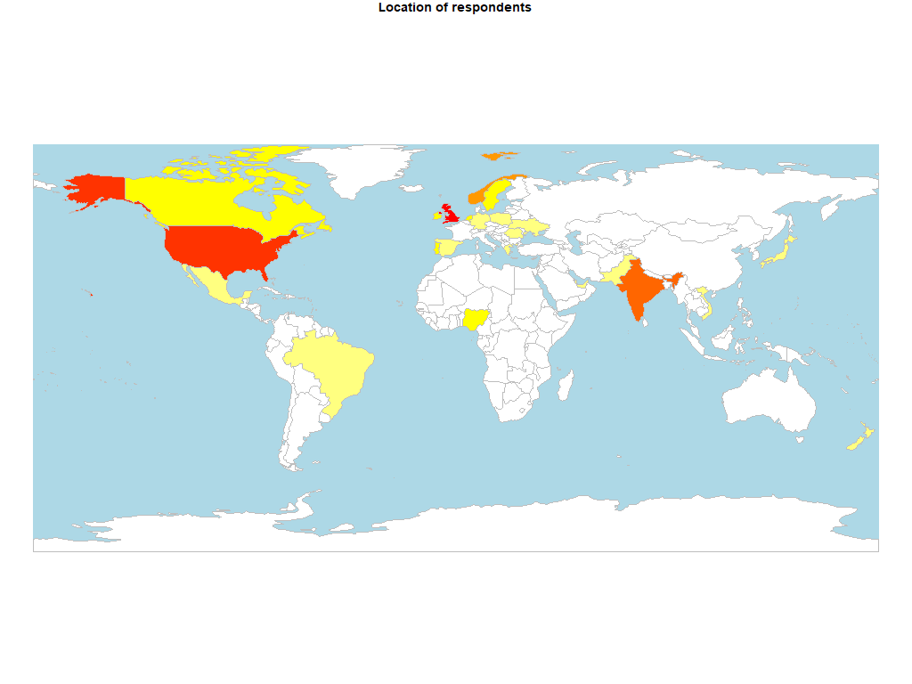
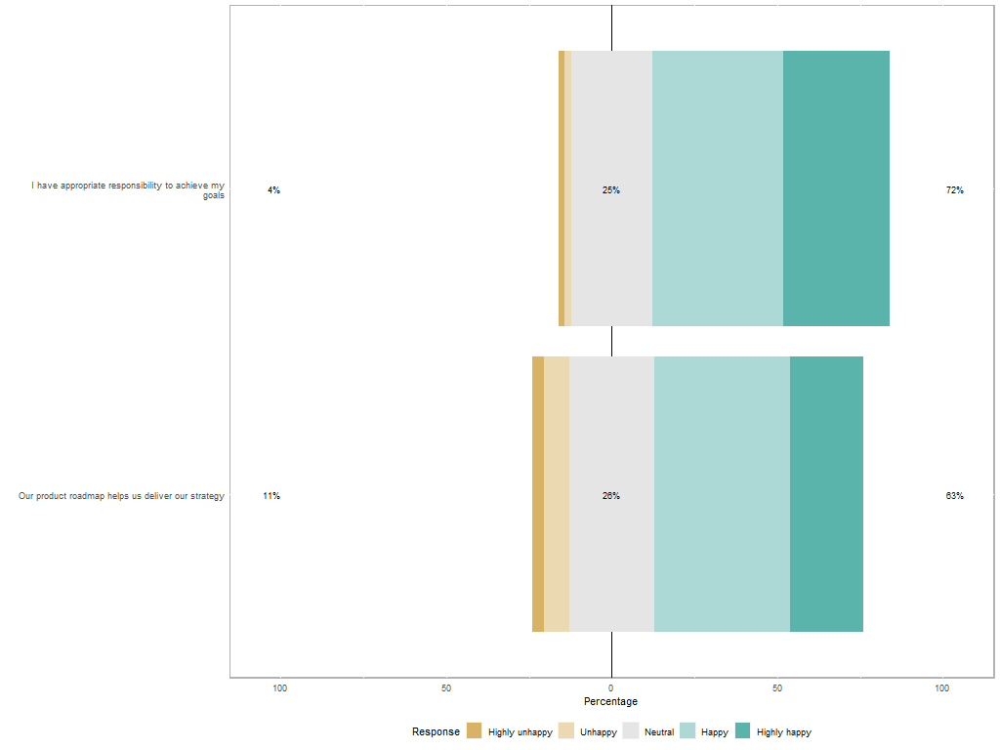
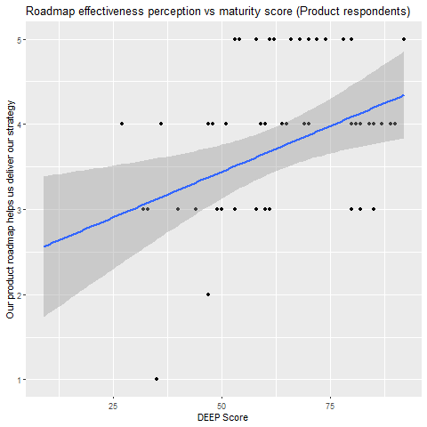

```{r setup, include=FALSE}
knitr::opts_chunk$set(echo = TRUE)
```

```{r summary, echo = FALSE, message=FALSE}
summary(report::report(sessionInfo()))
```

## Organisations

What is the make up of the organisations that the respondents are working in?

```{r org, echo=FALSE}
library(knitr)
library(dplyr)

summary(clean_responses[3:4]) %>% kable
summary(clean_responses[5:7]) %>% kable
```

And where are they located?



## Role

How happy were the respondents with their roadmap process and level of responsibility in the role?
```{r role, echo=FALSE}
clean_responses %>%
  select(Job.title, roadmap.happiness, role.happiness , roadmap.DEEPScore, roadmap.mat_level) %>% 
  group_by(Job.title) %>%
  summarise(n = n(),
            roadmap.happiness = mean(roadmap.happiness),
            role.happiness = mean(role.happiness))  %>% 
  kable(digits = 2)

lmHappyRole = lm(role.happiness ~ roadmap.DEEPScore , data = clean_responses) 
 ggplot(clean_responses,aes(x = roadmap.DEEPScore, y = role.happiness)) +
    geom_point(aes(x = roadmap.DEEPScore, y = role.happiness, colour = org.industry, shape = org.employees)) +
    geom_abline(slope = coef(lmHappyRole)[[2]], intercept = coef(lmHappyRole)[[1]], colour="#CC0000") +
    facet_wrap(~Job.title)
 

```






Where do people go to get their information?

```{r role2, echo=FALSE}
clean_responses %>%
  select(Job.title, info.events, info.blogs, info.books, info.communities, info.profbody, info.profcert, info.training, info.vendor, info.google) %>%
  group_by(Job.title) %>%
  summarise("Events and conferences" = sum(info.events)/n()*100,
            "Blogs" = sum(info.blogs)/n()*100,
            "Books" = sum(info.books)/n()*100,
            "Online Communities" = sum(info.communities)/n()*100,
            "Professional Bodies" = sum(info.profbody)/n()*100,
            "Professional Certification" = sum(info.profcert)/n()*100,
            "Professional Training" = sum(info.training)/n()*100,
            "Tool Vendor material" = sum(info.vendor)/n()*100,
            "Google" = sum(info.google)/n()*100)  %>% 
  kable(digits = 2)
```

Which professional bodies are they members of?

```{r profbdy, echo=FALSE}
clean_responses %>%
  select(Job.title, profbody.acm, profbody.aipmm, profbody.ami, profbody.apm, profbody.bcs, profbody.iaoip, profbody.ispma, profbody.pdma, profbody.none) %>%
  group_by(Job.title) %>%
  summarise("ACM" = round(sum(profbody.acm)/n()*100),
            "AIPMM" = sum(profbody.aipmm)/n()*100,
            "AMI" = sum(profbody.ami)/n()*100,
            "APM" = sum(profbody.apm)/n()*100,
            "BCS" = sum(profbody.bcs)/n()*100,
            "IAOIP" = sum(profbody.iaoip)/n()*100,
            "ISPMA" = sum(profbody.ispma)/n()*100,
            "PDMA" = sum(profbody.pdma)/n()*100,
            "None" = sum(profbody.none)/n()*100) %>%
  kable(digits = 2)
```

## Roadmap

How mature were the roadmap processes by job title of respondent? Also did happiness with the roadmap process correlate to a higher maturity score?

```{r roadmap, echo=FALSE}
library(qqplotr)
library(gridExtra)

#create model to check correlation
 lmHappyRoadmap = lm(roadmap.happiness ~ roadmap.DEEPScore , data = prod_responses)
  summary(lmHappyRoadmap)
  
clean_responses %>%
  select(Job.title, roadmap.DEEPScore, roadmap.mat_level) %>% 
  group_by(Job.title) %>%
  summarise(n = n(),
            roadmap.DEEPScore = mean(roadmap.DEEPScore),
            roadmap.mat_level = mean(roadmap.mat_level))  %>% 
  kable(digits = 2)


ggplot(prod_responses) +
  geom_point(aes(x = roadmap.happiness, y = roadmap.DEEPScore, colour = org.industry, shape = org.employees)) 

 summary(lmHappyRoadmap)
  anova(lmHappyRoadmap)
performance::check_model(lmHappyRoadmap)

```

## References 

```{r references, echo=FALSE, message=FALSE, error=FALSE}

report::cite_packages(sessionInfo())
```
