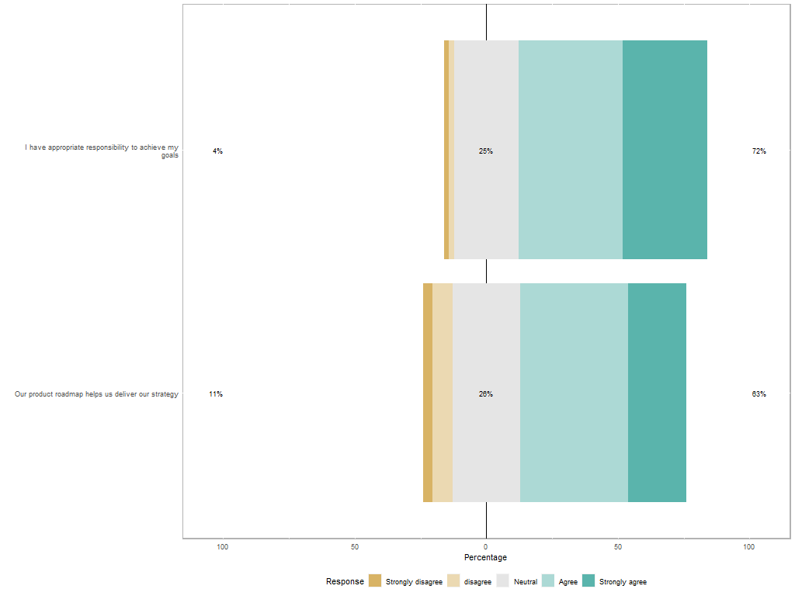

```{r setup, include=FALSE}
knitr::opts_chunk$set(echo = TRUE)
```

```{r summary, echo = FALSE, message=FALSE, tidy=TRUE, results='asis'}
summary(report::report(sessionInfo()))
```

# Descriptive Statistics


## Demographics - Organisational Context

What is the make up of the organisations that the respondents are working in?

```{r org, echo=FALSE}
library(knitr)
library(dplyr)

summary(clean_responses[3:4]) %>% kable
summary(clean_responses[5:7]) %>% kable
```


## Demographics - Respondents 

And where are they located?


## Perceptions of role and roadmap

How happy were the respondents with their roadmap process and level of responsibility in the role?
```{r role, echo=FALSE}
clean_responses %>%
  select(Job.title, roadmap.happiness, role.happiness , roadmap.DEEPScore, roadmap.mat_level) %>% 
  group_by(Job.title) %>%
  summarise(n = n(),
            roadmap.happiness = mean(roadmap.happiness),
            role.happiness = mean(role.happiness))  %>% 
  kable(digits = 2)


 

```





## Role - Responsibilities ISPMA model


## Information Sources

Where do people go to get their information?

```{r role2, echo=FALSE}
clean_responses %>%
  select(Job.title, info.events, info.blogs, info.books, info.communities, info.profbody, info.profcert, info.training, info.vendor, info.google) %>%
  group_by(Job.title) %>%
  summarise("Events and conferences" = sum(info.events)/n()*100,
            "Blogs" = sum(info.blogs)/n()*100,
            "Books" = sum(info.books)/n()*100,
            "Online Communities" = sum(info.communities)/n()*100,
            "Professional Bodies" = sum(info.profbody)/n()*100,
            "Professional Certification" = sum(info.profcert)/n()*100,
            "Professional Training" = sum(info.training)/n()*100,
            "Tool Vendor material" = sum(info.vendor)/n()*100,
            "Google" = sum(info.google)/n()*100)  %>% 
  kable(digits = 2)
```

Which professional bodies are they members of?

```{r profbdy, echo=FALSE}
clean_responses %>%
  select(Job.title, profbody.acm, profbody.aipmm, profbody.apm, profbody.bcs, profbody.iaoip, profbody.ispma, profbody.pdma, profbody.MTP, profbody.WiP, profbody.none) %>%
  group_by(Job.title) %>%
  summarise("ACM" = round(sum(profbody.acm)/n()*100),
            "AIPMM" = sum(profbody.aipmm)/n()*100,
            "BCS" = sum(profbody.bcs)/n()*100,
            "ISPMA" = sum(profbody.ispma)/n()*100,
            "PDMA" = sum(profbody.pdma)/n()*100,
            "MTP" = sum(profbody.MTP)/n()*100,
            "WiP" = sum(profbody.WiP)/n()*100,
            "None" = sum(profbody.none)/n()*100) %>%
  kable(digits = 2)
```

## DEEP Roadmap Maturity {.tabset}

There were a spread of responses, but generally skewing to the right. In the charts below the least "mature" practices are to the left and the highest scoring, mature processes to the right. (According to [DEEP Product Maturity Model](https://www.researchgate.net/publication/336070112_The_Product_Roadmap_Maturity_Model_DEEP_Validation_of_a_Method_for_Assessing_the_Product_Roadmap_Capabilities_of_Organizations) V1.1 By Munch, Trieflinger and Lang.)

### All responses

```{r deep_roadmap_all, echo=FALSE}
items <- clean_responses[,18:26]
colly <- names(items)


par(mfrow=c(3,3))

for(i in 1:ncol(items)) {
  plot(items[,i], main = colly[i], axes=FALSE)
  Axis(side=1, labels=FALSE)
  Axis(side=2, labels=TRUE)
}

mtext(paste("DEEP responses, n=" , nrow(items)), side=1, outer=TRUE, line=-3)
```

### Product responses

```{r deep_roadmap_prod, echo=FALSE}
items <- prod_responses[,18:26]
colly <- names(items)


par(mfrow=c(3,3))

for(i in 1:ncol(items)) {
  plot(items[,i], main = colly[i], axes=FALSE)
  Axis(side=1, labels=FALSE)
  Axis(side=2, labels=TRUE)
}

mtext(paste("DEEP responses, n=" , nrow(items)), side=1, outer=TRUE, line=-3)
```

### by job title

How mature were the roadmap processes by job title of respondent? 

```{r roadmap_des, echo=FALSE, results='asis'}
  
clean_responses %>%
  select(Job.title, roadmap.DEEPScore, roadmap.mat_level) %>% 
  group_by(Job.title) %>%
  summarise(n = n(),
            roadmap.DEEPScore = mean(roadmap.DEEPScore),
            roadmap.mat_level = mean(roadmap.mat_level))  %>% 
  kable(digits = 2)


```

## Tool usage {.tabset}

What kind of tools did the respondents use? 

### All

```{r tools_all, echo=FALSE, results='asis'}
  
    tools %>%
            select(custom , office , product , project ) %>%
            summarise("Custom Tools" = sum(custom)/n()*100,
                      "Office Tools" = sum(office)/n()*100,
                      "Specialist Product Tools" = sum(product)/n()*100,
                      "Project management tools" = sum(project)/n()*100)  %>% 
  kable(digits = 2)

 tools %>%
  select(roadmap.tools ) %>%
  group_by(roadmap.tools)%>%
  tally(sort = T) %>%
  ungroup() %>%
  arrange(desc(n)) %>%
      kable

```

### Product

```{r tools_pm, echo=FALSE, results='asis'}

 pm.tools <-      tools %>%
             filter(grepl('Product', Job.title)) 
  
    pm.tools %>%
            select(custom , office , product , project ) %>%
            summarise("Custom Tools" = sum(custom)/n()*100,
                      "Office Tools" = sum(office)/n()*100,
                      "Specialist Product Tools" = sum(product)/n()*100,
                      "Project management tools" = sum(project)/n()*100) %>% 
  kable(digits = 2)

    pm.tools %>%
  select(roadmap.tools ) %>%
  group_by(roadmap.tools)%>%
  tally(sort = T) %>%
  ungroup() %>%
  arrange(desc(n)) %>%
      kable

```

# Inferential Statistics 

did happiness with the roadmap process correlate to a higher maturity score?


```{r roadmap_inf, echo=FALSE, results='asis'}
library(qqplotr)
library(gridExtra)

#create model to check correlation
 lmHappyRoadmap = lm(roadmap.happiness ~ roadmap.DEEPScore , data = prod_responses)


ggplot(prod_responses) +
  geom_point(aes(x = roadmap.happiness, y = roadmap.DEEPScore, colour = org.industry, shape = org.employees)) 

  summary(lmHappyRoadmap)
  anova(lmHappyRoadmap)
performance::check_model(lmHappyRoadmap)

lmHappyRole = lm(role.happiness ~ roadmap.DEEPScore , data = clean_responses) 
 ggplot(clean_responses,aes(x = roadmap.DEEPScore, y = role.happiness)) +
    geom_point(aes(x = roadmap.DEEPScore, y = role.happiness, colour = org.industry, shape = org.employees)) +
    geom_abline(slope = coef(lmHappyRole)[[2]], intercept = coef(lmHappyRole)[[1]], colour="#CC0000") +
    facet_wrap(~Job.title)
 
```


## References 

```{r references, echo=FALSE, message=FALSE, error=FALSE, results='asis'}

report::cite_packages(sessionInfo())
```
