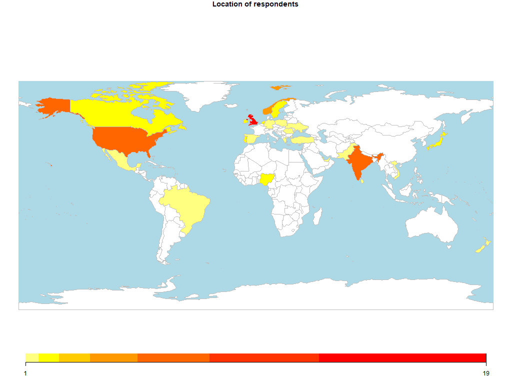

```{r setup, include=FALSE}
knitr::opts_chunk$set(echo = TRUE)
```

## Organisations

What is the make up of the organisations that the respondents are working in?

```{r org, echo=FALSE}
summary(clean_responses[3:4])
summary(clean_responses[5:7])
```

And where are they located?



## Role

How happy were the respondents with their roadmap process and level of responsibilty in the role?
```{r role, echo=FALSE}
clean_responses %>%
  select(Job.title, roadmap.happiness, role.happiness , roadmap.DEEPScore, roadmap.mat_level) %>% 
  group_by(Job.title) %>%
  summarise(n = n(),
            roadmap.happiness = mean(roadmap.happiness),
            role.happiness = mean(role.happiness)) 

```


## Roadmap

How mature were the roadmap processes by job title of respondent? Also did happiness with the roadmap process lead to a higher maturity score?
```{r roadmap, echo=FALSE}
clean_responses %>%
  select(Job.title, roadmap.DEEPScore, roadmap.mat_level) %>% 
  group_by(Job.title) %>%
  summarise(n = n(),
            roadmap.DEEPScore = mean(roadmap.DEEPScore),
            roadmap.mat_level = mean(roadmap.mat_level)) 


ggplot(clean_responses) +
  geom_point(aes(x = roadmap.happiness, y = roadmap.DEEPScore, colour = roadmap.mat_level)) 

```